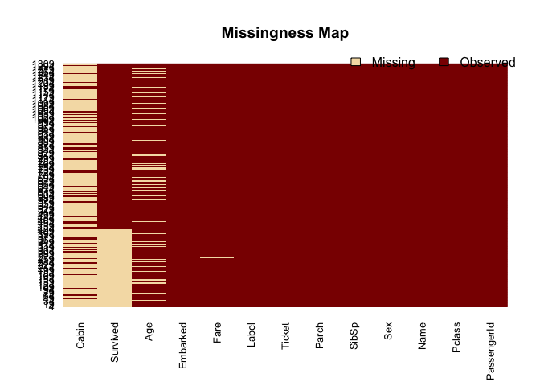

# Kaggle’s Titanic Survival Prediction

## Introduction
This file describes how I solve Kaggle's [Titanic: Machine Learning from Disaster](https://www.kaggle.com/c/titanic) competition. It will be keeping updated when I improve the result. The current personal best is the prediction accuracy of 0.80383 using Random Forest, which ranks 685 out of 3605.

### Prepare the environment

```r
library(knitr)
opts_chunk$set('results' = 'hold', 'message' = FALSE, 'warning' = FALSE)
library(plyr)
library(ggplot2)
library(Amelia)
library(caret)
library(rpart)
library(pROC)
library(gridExtra)
```

## Data exploring and pre-processing

### Data exploring

Load the training and testing data from files.

```r
titanic_train <- read.csv("train.csv", na.strings = c('NA', ''))
titanic_test <- read.csv("test.csv", na.strings = c('NA', ''))
titanic_train$Label <- "Train" # Add column to identify train set in combined set
titanic_test$Label <- "Test"   # Add column to identify test set in combined set 
str(titanic_train)
titanic_train$Survived <- as.factor(titanic_train$Survived)
```

```
## 'data.frame':	891 obs. of  13 variables:
##  $ PassengerId: int  1 2 3 4 5 6 7 8 9 10 ...
##  $ Survived   : int  0 1 1 1 0 0 0 0 1 1 ...
##  $ Pclass     : int  3 1 3 1 3 3 1 3 3 2 ...
##  $ Name       : Factor w/ 891 levels "Abbing, Mr. Anthony",..: 109 191 358 277 16 559 520 629 417 581 ...
##  $ Sex        : Factor w/ 2 levels "female","male": 2 1 1 1 2 2 2 2 1 1 ...
##  $ Age        : num  22 38 26 35 35 NA 54 2 27 14 ...
##  $ SibSp      : int  1 1 0 1 0 0 0 3 0 1 ...
##  $ Parch      : int  0 0 0 0 0 0 0 1 2 0 ...
##  $ Ticket     : Factor w/ 681 levels "110152","110413",..: 524 597 670 50 473 276 86 396 345 133 ...
##  $ Fare       : num  7.25 71.28 7.92 53.1 8.05 ...
##  $ Cabin      : Factor w/ 147 levels "A10","A14","A16",..: NA 82 NA 56 NA NA 130 NA NA NA ...
##  $ Embarked   : Factor w/ 3 levels "C","Q","S": 3 1 3 3 3 2 3 3 3 1 ...
##  $ Label      : chr  "Train" "Train" "Train" "Train" ...
```

First, let's see how the variables affect the survive rate.

```r
#mosaicplot(Pclass ~ Survived, data = df.train1, main = 'Survival Rate by Passenger Class', color = TRUE)
#mosaicplot(Sex ~ Survived, data = df.train1, main = 'Survival Rate by Gender', color = TRUE)
#mosaicplot(Embarked ~ Survived, data = df.train1, main = 'Survival Rate by Ports', color = TRUE)
#barplot(table(df.train1$Embarked))
p <- ggplot(titanic_train)

p1 <- p + geom_bar(aes(Pclass, fill = Survived))
p2 <- p + geom_bar(aes(Sex, fill = Survived))
p3 <- p + geom_histogram(aes(Age, fill = Survived), binwidth = 5)
p4 <- p + geom_bar(aes(SibSp, fill = Survived))
p5 <- p + geom_bar(aes(Parch, fill = Survived))
p6 <- p + geom_histogram(aes(Fare, fill = Survived), binwidth = 20)
p7 <- p + geom_bar(aes(Embarked, fill = Survived))

grid.arrange(p1, p2, p3, p4, p5, p6, p7, ncol =2)
```

 

From these figures, we have the following observations:

* The passengers of the first class have a better survival rate than those of the third class.
* The female and children have a larger chance to survive.
* Not sure how number of family members (SibSp and Parch) affects the survival rate.
* The passengers paying a higher fare seem to have a better survival than those paying less, but the data set is too small.
* The embarked port doesn't affect the survival rate much.
 
### Data pre-processing

First, combine the training set and the testing set.

```r
titanic_test$Survived <- NA # add the survived column to the test set, and set the values to NA
full_titanic <- rbind(titanic_train, titanic_test)
str(full_titanic)
```

```
## 'data.frame':	1309 obs. of  13 variables:
##  $ PassengerId: int  1 2 3 4 5 6 7 8 9 10 ...
##  $ Survived   : Factor w/ 2 levels "0","1": 1 2 2 2 1 1 1 1 2 2 ...
##  $ Pclass     : int  3 1 3 1 3 3 1 3 3 2 ...
##  $ Name       : Factor w/ 1307 levels "Abbing, Mr. Anthony",..: 109 191 358 277 16 559 520 629 417 581 ...
##  $ Sex        : Factor w/ 2 levels "female","male": 2 1 1 1 2 2 2 2 1 1 ...
##  $ Age        : num  22 38 26 35 35 NA 54 2 27 14 ...
##  $ SibSp      : int  1 1 0 1 0 0 0 3 0 1 ...
##  $ Parch      : int  0 0 0 0 0 0 0 1 2 0 ...
##  $ Ticket     : Factor w/ 929 levels "110152","110413",..: 524 597 670 50 473 276 86 396 345 133 ...
##  $ Fare       : num  7.25 71.28 7.92 53.1 8.05 ...
##  $ Cabin      : Factor w/ 186 levels "A10","A14","A16",..: NA 82 NA 56 NA NA 130 NA NA NA ...
##  $ Embarked   : Factor w/ 3 levels "C","Q","S": 3 1 3 3 3 2 3 3 3 1 ...
##  $ Label      : chr  "Train" "Train" "Train" "Train" ...
```

Then, clean up data. 

```r
full_titanic$Name <- as.character(full_titanic$Name)
full_titanic$Ticket <- as.character(full_titanic$Ticket)
full_titanic$Cabin <- as.character(full_titanic$Cabin)
```

Find out the missing values in the data set using missmap function from Amelia.

```r
missmap(full_titanic)
```

 

```r
apply(full_titanic, 2, FUN = function(x) sum(is.na(x)))
```

```
## PassengerId    Survived      Pclass        Name         Sex         Age 
##           0         418           0           0           0         263 
##       SibSp       Parch      Ticket        Fare       Cabin    Embarked 
##           0           0           0           1        1014           2 
##       Label 
##           0
```

Since Cabin has too many missing values (1014 out of 1309 samples), we will not use it in our model. To fix the missing Fare value, we use the median of the fares from the same class


```r
fare_Pclass <- aggregate(Fare ~ Pclass, full_titanic, FUN = median)
full_titanic$Fare[is.na(full_titanic$Fare)] <- fare_Pclass$Fare[full_titanic$Pclass[is.na(full_titanic$Fare)]]
```

There are two missing values in Embarked. Since most of the people are embarked from S. We assign the two missing values 'S'.


```r
table(full_titanic$Embarked)
full_titanic$Embarked[is.na(full_titanic$Embarked)] <- 'S'
apply(full_titanic, 2, FUN = function(x) sum(is.na(x)))
```

```
## 
##   C   Q   S 
## 270 123 914 
## PassengerId    Survived      Pclass        Name         Sex         Age 
##           0         418           0           0           0         263 
##       SibSp       Parch      Ticket        Fare       Cabin    Embarked 
##           0           0           0           0        1014           0 
##       Label 
##           0
```

Now let's deal with the missing ages. The idea is to generate a new feature Title from the names, and then to use it to impute the missing age values. We use the following getTitle function to generate Title. The idea and the function are from [Curt Wehrley](https://github.com/wehrley/wehrley.github.io/blob/master/SOUPTONUTS.md).


```r
getTitle <- function(data) {
  title.dot.start <- regexpr("\\,[A-Z ]{1,20}\\.", data$Name, TRUE)
  title.comma.end <- title.dot.start + attr(title.dot.start, "match.length")-1
  data$Title <- substr(data$Name, title.dot.start+2, title.comma.end-1)
  return (data$Title)
}

full_titanic$Title <- getTitle(full_titanic)
table(full_titanic$Title)
```

```
## 
##         Capt          Col          Don         Dona           Dr 
##            1            4            1            1            8 
##     Jonkheer         Lady        Major       Master         Miss 
##            1            1            2           61          260 
##         Mlle          Mme           Mr          Mrs           Ms 
##            2            1          757          197            2 
##          Rev          Sir the Countess 
##            8            1            1
```
The most common titles are Master, Miss, Mr, Mrs, and other titles are only rarely used. So we want merge some titles in different classes. This idea as well as the changeTitle function come from [tysonasilver](http://www.libertyanddata.com/predicting-titanic-survivors-using-r/). The only difference is that the title "the Countess" is now moved to Noble.


```r
changeTitles <- function(data, old.titles, new.title) {
  for (honorific in old.titles) {
    data$Title[ which( data$Title == honorific)] <- new.title
  }
  return (data$Title)
}

full_titanic$Title <- changeTitles(full_titanic, c("Capt", "Col", "Don", "Dona", "Dr", "Jonkheer", "Lady", "Major", "Rev", "Sir", "the Countess"), "Noble")
full_titanic$Title <- changeTitles(full_titanic, c("Ms"), "Mrs")
full_titanic$Title <- changeTitles(full_titanic, c("Mlle", "Mme"), "Miss")
full_titanic$Title <- as.factor(full_titanic$Title) # We want to change Title from character to factor

table(full_titanic$Title)
```

```
## 
## Master   Miss     Mr    Mrs  Noble 
##     61    263    757    199     29
```

Now we are ready to fix the missing ages using a decision tree.


```r
set.seed(825)
ages.est <- rpart(Age ~ Sex + Pclass + SibSp + Parch + Fare + Embarked + Title, data = full_titanic[!is.na(full_titanic$Age), ], method = "anova")
full_titanic$Age[is.na(full_titanic$Age)] <- predict(ages.est, newdata = full_titanic[is.na(full_titanic$Age), ])

apply(full_titanic, 2, FUN = function(x) sum(is.na(x)))
```

```
## PassengerId    Survived      Pclass        Name         Sex         Age 
##           0         418           0           0           0           0 
##       SibSp       Parch      Ticket        Fare       Cabin    Embarked 
##           0           0           0           0        1014           0 
##       Label       Title 
##           0           0
```

Combine SibSp and Parch to new feature Family.

```r
full_titanic$Family <- full_titanic$SibSp + full_titanic$Parch + 1
```


Before building the model, we first split the data back to train and test sets

```r
titanic_train <- full_titanic[full_titanic$Label == 'Train', ]
titanic_test <- full_titanic[full_titanic$Label == 'Test', ]
```

## GAM (Generalized Additive Model)


## Random Forest


```r
set.seed(825)
fitControl <- trainControl(method = 'repeatedcv', number = 10, repeats = 10)
rf.model <- train(Survived ~ Pclass + Sex + Age + SibSp + Parch + Family + Fare + Embarked + Title, data = titanic_train, method = "rf", trControl = fitControl)
rf.model
#confusionMatrix(predict(rf.model, newdata = titanic_train), train$Survived)

rf.test <- predict(rf.model, newdata = titanic_test)
rf_submission <- data.frame(PassengerId = titanic_test$PassengerId, Survived = rf.test)
write.csv(rf_submission, file = "rf_submission_xu.csv", row.names = FALSE)
```

```
## Random Forest 
## 
## 891 samples
##  14 predictor
##   2 classes: '0', '1' 
## 
## No pre-processing
## Resampling: Cross-Validated (10 fold, repeated 10 times) 
## Summary of sample sizes: 801, 801, 802, 803, 802, 802, ... 
## Resampling results across tuning parameters:
## 
##   mtry  Accuracy   Kappa      Accuracy SD  Kappa SD  
##    2    0.8300752  0.6321415  0.03474744   0.07678835
##    7    0.8242422  0.6226465  0.03729074   0.08140860
##   13    0.8151308  0.6054187  0.03681493   0.07954678
## 
## Accuracy was used to select the optimal model using  the largest value.
## The final value used for the model was mtry = 2.
```
